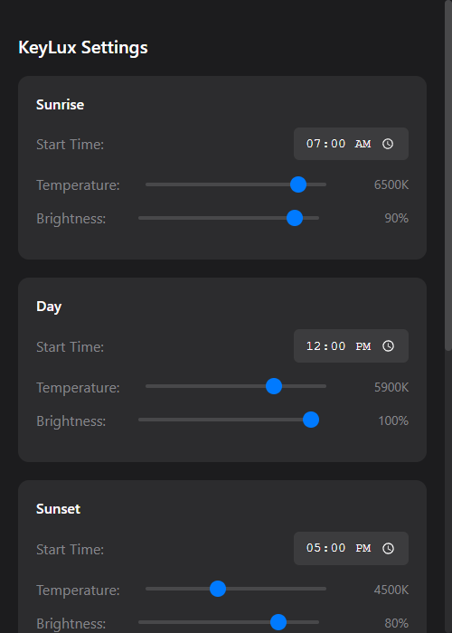

  

  
  
  

 
<h2> 
<b>KeyLux: Automated f.lux-style lighting control for Elgato Key Lights</b>
 </h2>

# 💡 What is KeyLux?

**KeyLux** is a desktop application that automatically adjusts your Elgato Key Light's brightness and color temperature throughout the day, similar to how f.lux manages your screen's blue light. It transitions smoothly from energizing daylight colors in the morning to warm, comfortable tones in the evening, helping reduce eye strain during long streaming or recording sessions.

  

***

# ✨ Key Features
- **Automatic Adjustments**: Seamlessly adjusts brightness and color temperature based on time of day
- **Smart Transitions**: Smooth transitions between lighting states to avoid jarring changes
- **System Tray Integration**: Quick access to controls and settings
- **Dark Mode Interface**: Easy on the eyes with a modern dark theme
- **Customizable Schedule**: Set your own transition points and preferences
- **Multiple Device Support**: Works with both Elgato Key Light and Key Light Air

# 📋 Usage Instructions

1. **Install**: Download KeyLux from the [Releases Page](https://github.com/kenhendricks00/KeyLux/releases)
2. **Launch**: Run the application - it will automatically detect your Elgato Key Light
3. **Customize**: Access settings through the system tray icon to adjust transition times and preferences
4. **Enjoy**: Let KeyLux automatically manage your lighting throughout the day

# 🌟 Why Choose KeyLux?

- **Eye Comfort**: Reduces eye strain by automatically adjusting light temperature and brightness
- **Set and Forget**: Once configured, works automatically in the background
- **Content Creator Focused**: Designed specifically for Elgato Key Light users
- **Resource Efficient**: Minimal system impact while running in the background
- **Open Source**: Free to use and open to community contributions

# 🚀 Get Started

To start using KeyLux:
1. Download the latest release from our [Releases page](https://github.com/kenhendricks00/KeyLux/releases)
2. Install and run the application
3. Configure your preferred schedule and settings through the interface
4. Let KeyLux handle your lighting automatically

# 💬 Support & Contributions

For questions or support, feel free to open an issue on [GitHub](https://github.com/kenhendricks00/KeyLux/issues). Contributions are welcome! Check out our contribution guidelines.

# 🌐 Quick Links
- [Download Latest Release](https://github.com/kenhendricks00/KeyLux/releases)
- [Report an Issue](https://github.com/kenhendricks00/KeyLux/issues)
- [Contribute](https://github.com/kenhendricks00/KeyLux/pulls)

# 📜 Credits
- F.lux for inspiration on automatic color temperature adjustment
- Elgato for their Key Light API
